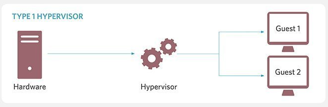

---
layout:
  title:
    visible: true
  description:
    visible: false
  tableOfContents:
    visible: true
  outline:
    visible: true
  pagination:
    visible: true
---

# Hypervisors

Create and manage virtual machines or virtual networks

## <mark style="color:blue;">Type I</mark>

* Directly conected to hardware

<figure><figcaption>
<a href="https://www.techtarget.com/searchitoperations/tip/Whats-the-difference-between-Type-1-vs-Type-2-hypervisor">https://www.techtarget.com/searchitoperations/tip/Whats-the-difference-between-Type-1-vs-Type-2-hypervisor</a>
</figcaption></figure>

### <mark style="color:blue;">Type II</mark>

* Software defined, has another layer of abstraction between hardware and operative system.
* Are easier to used by the cost of performance

<figure><figcaption>
<a href="https://www.techtarget.com/searchitoperations/tip/Whats-the-difference-between-Type-1-vs-Type-2-hypervisor">https://www.techtarget.com/searchitoperations/tip/Whats-the-difference-between-Type-1-vs-Type-2-hypervisor</a>
</figcaption></figure>

